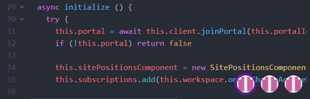

# Report
#### Trivia
* **Student** : Adrien HALLET
* **University** : Université Catholique de Louvain (@UCLouvain)
* **Course** : LINGI2401 - *Open Source strategy for software development*
* **Lecturer** : Lionel Dricot
* **Year** : Academic year 2018-2019, Q1
---
## The Goal
* **Project** : [Atom/teletype](https://github.com/atom/teletype)
* **Type** : Live-collaboration tool
* **Objective** : Solve a minor UX problem

[Teletype](https://teletype.atom.io/) is an official package for [Atom text editor](https://atom.io/). It enables live-cooperation on the same document (useful for pair programming, note taking, etc).

When we started using it, I noticed that on small windows (either by the screen size or the window's manual resize), a feature that is intended to provide the user the information on who is connected to the document gets in the way and reduces code readability. After a while it also became useless because most of the time we don't need to know who is on the workspace. This is backed by a poll which tells us that [89.3% of the userbase only use 2 participants per portal](https://user-images.githubusercontent.com/2988/34171430-4c998816-e4bc-11e7-8a13-34b21885733c.png).

Here is an illustration of the problem :

## Getting in the Project

This is not the first project I get into. But this one really hit me as a state of the art (cluster of) repository and group project in general. You can see that Atom indeed comes from GitHub. It is huge, but tidy and well-maintained. There are many repositories, even their core features are split between different origins. Teletype's repository only contains the code and redirects to the main repository for all the contact informations.

* Day 1 : Conecting to their chatroom, I read the contributions guidelines and followed the link to their [flight manual](https://flight-manual.atom.io/). Setting the project up was not that difficult considering its sheer size. Running the tests was more of a challenge, but nothing that could not be done in a few hours (mainly due to database conflicts).

* Day 2 : I now needed to understand how atom works. I never worked with Electron (a cross-platform build framework that Atom is built on); so I researched about it. For GUI, I usually use native (*e.g.: JavaFX*) or popular low-level libraries (*e.g.: Qt*). This kind of local website approach is surprisingly convenient for a lot of aspects (uniform user experience, cross-platform compatibility, front-end development). 
